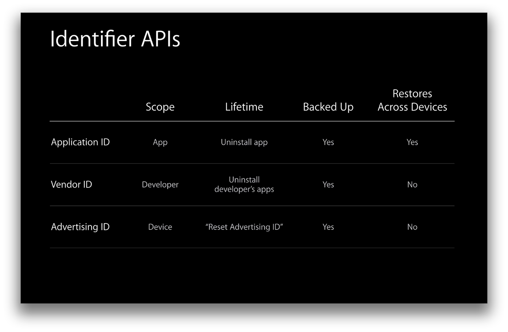
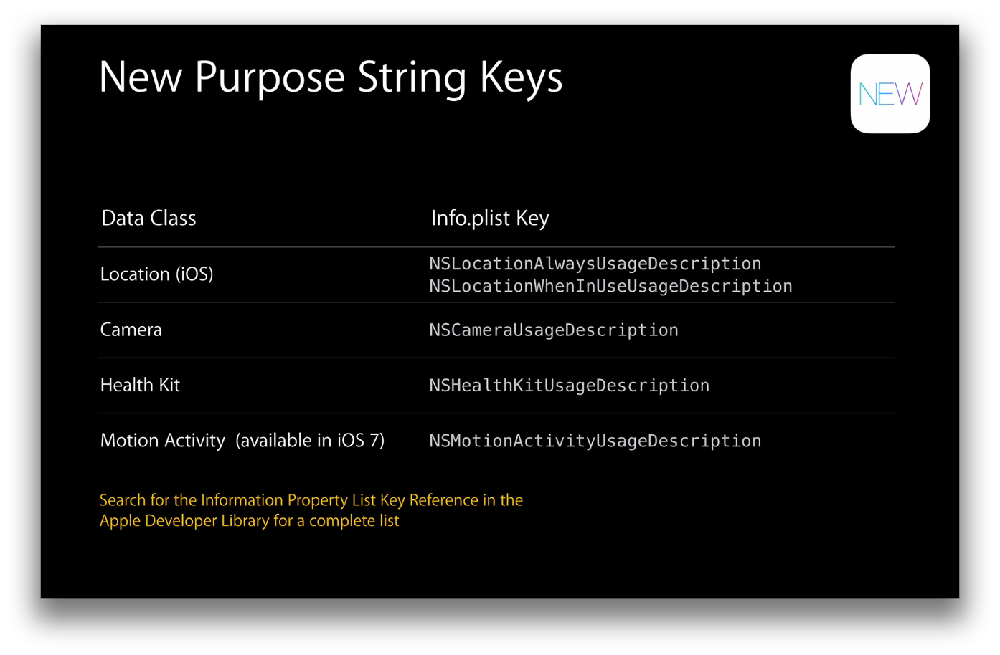
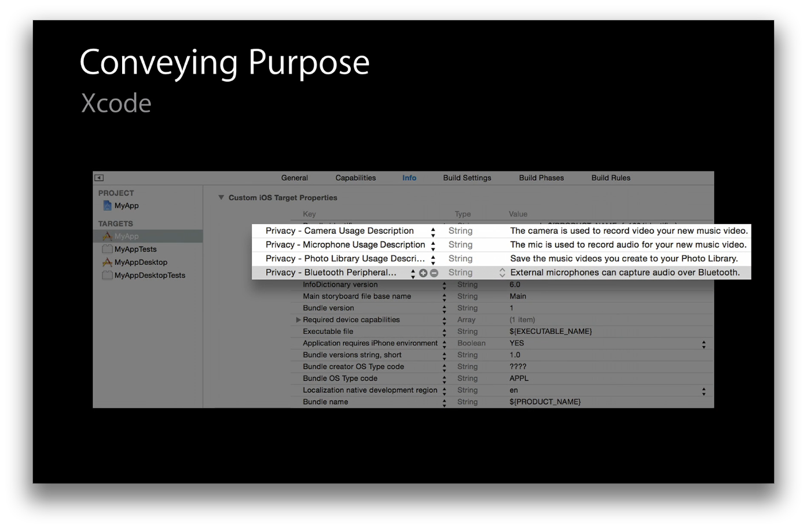

User Privacy in Camera And Photos
=================================

Notes from [Session 715 in WWDC 2014](https://developer.apple.com/videos/wwdc/2014/)

##There are three identifiers:
* Application Identifier - [NSUUID UUID]
* Vendor Identifier - [[UIDevice currentDevice] identifierForVendor]
* Advertising Identifier - [[UIDevice currentDevice] identifierForAdvertising]

##People Picker has changed API
`ABPeoplePickerNavigationController` has changes in API and introduces new properties to [customize display and selection](https://developer.apple.com/library/ios/documentation/addressbookui/reference/ABPeoplePickerNavigationController_Class/index.html#//apple_ref/doc/uid/TP40007078-CH3-SW7).

##One screen for all iOS permissions
Send users directly to [privacy settings](https://developer.apple.com/library/ios/documentation/UIKit/Reference/UIApplication_Class/index.html#//apple_ref/c/data/UIApplicationOpenSettingsURLString):
`[[UIApplication sharedApplication] openURL:[NSURL URLWithString:@"UIApplicationOpenSettingsURLString"]];`

##Purpose Strings
Add purpose strings to consent dialogues (class `Privacy -` in Info keys). New Purpose strings added are:

The Strings can be added in the Info.plist file: (to localize add strings to Localizable.strings)

##SIGKILL Note
* For iOS, any permission change sends a `SIGKILL` to your app, so the app should be ready for it at any time.

##Camera permissions
If the user denies camera permission, the camera stream blocks, and just a black screen appears. If you are using `UIImagePickerController`, best way to know about the authorization status is via `[AVCaptureDevice authorizationStatusForMediaType:AVMediaTypeVideo]` [authorizationStatusForMediaType:](https://developer.apple.com/library/iOs/documentation/AVFoundation/Reference/AVCaptureDevice_Class/index.html#//apple_ref/occ/clm/AVCaptureDevice/authorizationStatusForMediaType:)
